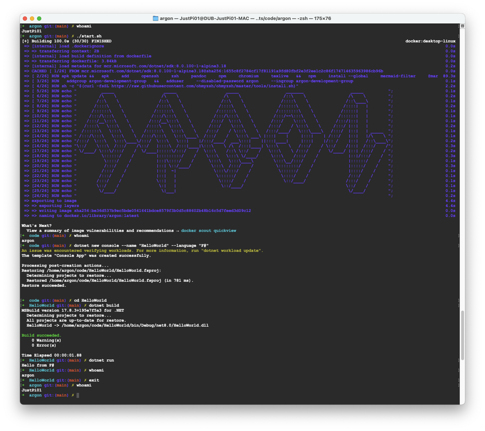

- [argon](#argon)
  * [features](#features)
  * [manifesto](#manifesto)
  * [host requirements](#host-requirements)
  * [how to](#how-to)
    + [start](#start)
    + [stop](#stop)
    + [customisation](#customisation)
      - [`ARG`](#-arg-)
      - [volumes](#volumes)
  * [examples](#examples)
  * [resources](#resources)

# argon

Minimal dotnet development environment.

Build and run your code in a container exposing an interactive bash shell. It looks like your regular shell, but everything is installed and running in a docker container. When you're done, simply `exit` argon shell to get back to your regular shell.

## features

* `alpine 3.19` base
* `zsh` + `oh my zsh`
* `.net 7.0 sdk` as an `apk` package (earlier versions of argon used the microsoft .net 8.0 sdk alpine base image which came with dotnet pre-installed)
* `markdwn`
  * `pandoc`
  * `mermaid`
  * `pdflatex` (via `texlive`)
  * `marp`

## manifesto

* \**lean* and \*\**quiet* development environment
* take your development environment anywhere
* low expectations from your text editor - keep it:
  * vanilla
  * removed from the equation
* reuse host's ssh keys

---

* \**lean* - minimal number of unused components
* \*\**quiet* - minimal number of errors

## host requirements

* docker
* zsh

## how to

### start

`./start.sh`

### stop

`exit`

### customisation

#### `ARG`

* **`$USER_NAME`** - controls the name of the default account controlling the development environment. Possible values:
  * **root** - default value, **root** will be the default user acount
  * **[any other value]** - will result in creating **argon-development-group** group and a non-root default member account named **[any other value]**

#### volumes

* **`$CERTIFICATE_DIRECTORY`** - host's `.ssh` directory

## examples

See this repository: https://github.com/PiotrJustyna/argon-examples

## resources

* [text to ascii art generator](https://patorjk.com/software/taag/#p=display&f=Graffiti&t=Type%20Something%20)
* [github wiki toc generator](https://ecotrust-canada.github.io/markdown-toc/)