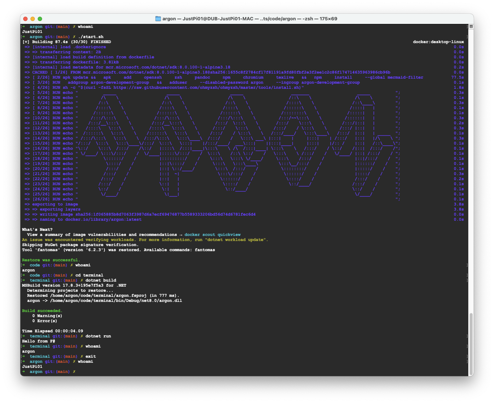

# argon

minimal f# development environment

* `alpine 3.18`
  * `arm64`
  * `amd64`
* `zsh` + `oh my zsh`
* `.net 8.0`
  * `fantomas`
* `pandoc`
  * `mermaid`
  * `pdflatex` (via `texlive`)

## manifest

* \**lean* and \*\**quiet* development environment
* take your development environment anywhere
* low expectations from yout text editor:
  * keep your text editor vanilla
  * and removed from the equation
* reuse host's ssh keys

---

* \**lean* - minimal number of unused components
* \*\**quiet* - minimal number of errors

## host requirements

* docker
* zsh

## start

`./start.sh`

## stop

`exit`

## markdown

`./render-docs.sh`