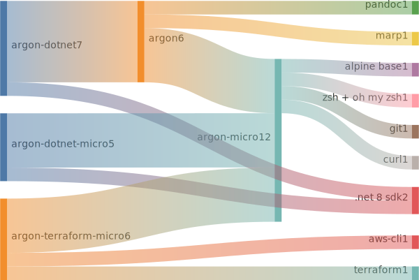

- [argon](#argon)
  - [features](#features)
    - [argon-micro](#argon-micro)
    - [argon-micro-dotnet](#argon-micro-dotnet)
    - [argon](#argon-1)
    - [argon-dotnet](#argon-dotnet)
  - [manifesto](#manifesto)
  - [host requirements](#host-requirements)
  - [how to](#how-to)
    - [start](#start)
    - [stop](#stop)
    - [customisation](#customisation)
      - [`ARG`](#arg)
      - [volumes](#volumes)
  - [resources](#resources)

# argon

Minimal development environment.

Build and run your code in a container exposing an interactive zsh shell. It looks like your regular shell, but everything is installed and running in a docker container. When you're done, simply `exit` argon shell to get back to your regular shell.

## features

Argon supports two types of cpu architectures:

* arm64

* amd64

### argon-micro

Only core features of base argon:

* `alpine 3.20.2` base

* `zsh` + `oh my zsh`

* `git`

* `openssh`

* `curl`

### argon-micro-dotnet

Dotnet development support.

* argon-micro

* `.net 8.0 sdk` as an `apk` package

### argon-micro-terraform

Terraform + aws development support. This environment comes with a lower base version of alpine as the terraform package is no longer included in alpine 2.19+. Host aws credentials are shared with the development environment container.

* argon-micro

* terraform

* aws cli

### argon

A more fleshed out base version of argon - just basic documentation-writing tools.

* argon-micro

* `markdown`

  * `pandoc`

  * `mermaid`

  * `pdflatex` (via `texlive`)

  * `marp`

### argon-dotnet

Dotnet development support.

* argon

* `.net 8.0 sdk` as an `apk` package

## manifesto

* \**lean* and \*\**quiet* development environment

* take your development environment anywhere

* low expectations from your text editor - keep it:

  * vanilla

  * removed from the equation

* reuse host's ssh keys

---

* \**lean* - minimal number of unused components

* \*\**quiet* - minimal number of errors

## host requirements

* docker

## how to

### start

* `./[argon type here*]/host.sh` - starts the development environment

\**where argon type is argon micro, argon, argon-dotnet, etc...*

### stop

`exit`

### customisation

#### `ARG`

* **`$USER_NAME`** - controls the name of the default account controlling the development environment. Possible values:

  * **root** - default value, **root** will be the default user acount

  * **[any other value]** - will result in creating **argon-development-group** group and a non-root default member account named **[any other value]**

#### volumes

* **`$CERTIFICATE_DIRECTORY`** - host's `.ssh` directory. This is useful for upstream git operations.

## resources

* [text to ascii art generator](https://patorjk.com/software/taag/#p=display&f=Graffiti&t=Type%20Something%20)

* [github wiki toc generator](https://ecotrust-canada.github.io/markdown-toc/)
